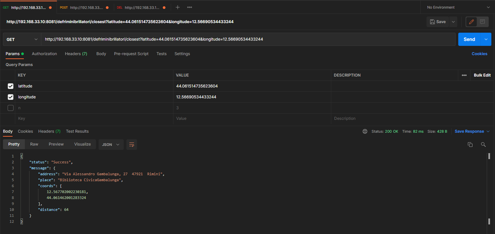
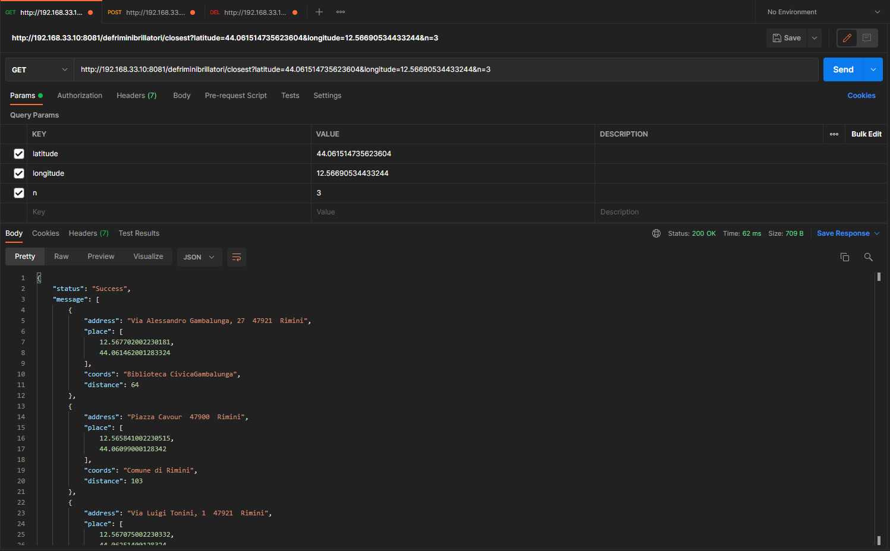
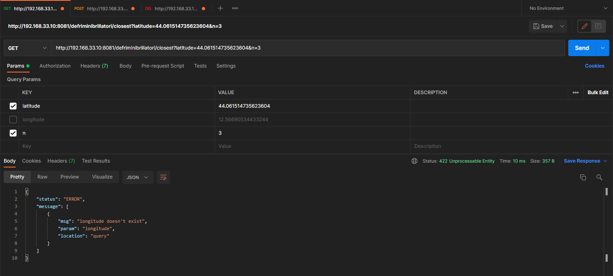
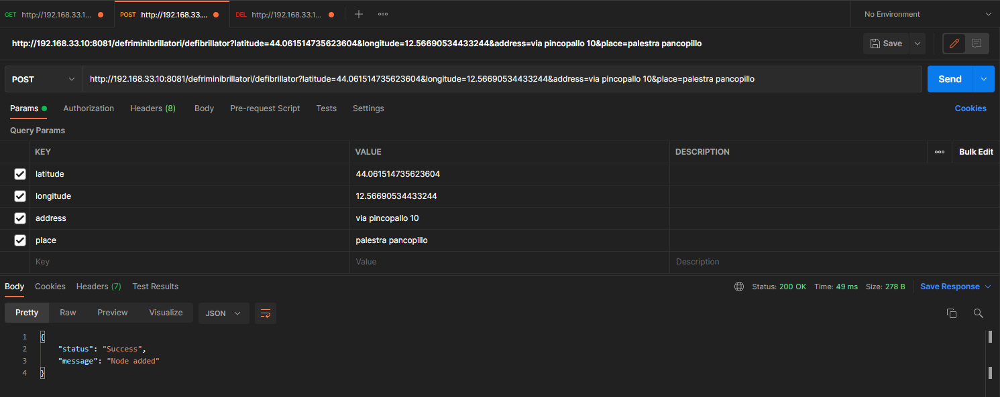
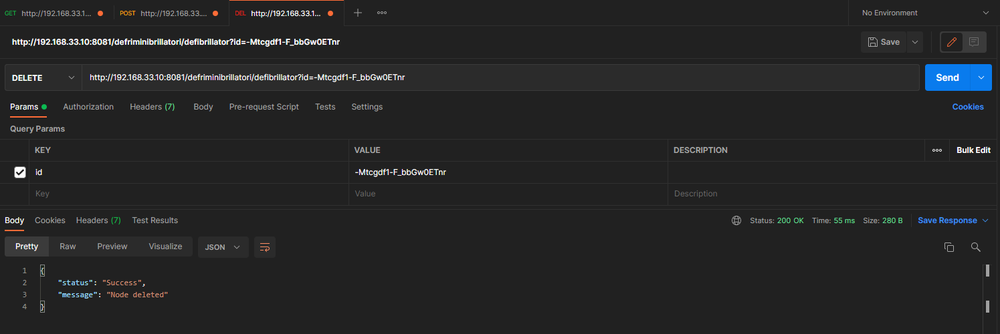
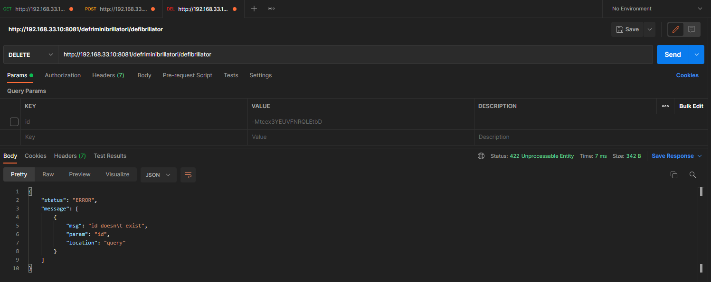

# Defriminibrillatori 

Alberto Facondini - 277526

## Indice
* [Descrizione servizio](#descrizione-servizio)
* [Descrizione architettura](#descrizione-architettura)
* [Dati e servizi esterni](#dati-e-servizi-esterni)
* [Documentazione API](#documentazione-api)
* [Descrizione della messa online del servizio](#descrizione-della-messa-online-del-servizio)
* [Esempi](#esempi)
* [Licenza](#licenza)

## Descrizione servizio

Il servizio nasce allo scopo di rendere più immediato trovare la posizione del defibrillatore automatico più vicino fra quelli disponibili pubblicamente nella città di Rimini.

Inviando al servizio le proprie coordinate geografiche, questo risponde con luogo, indirizzo, coordinate e distanza di uno o più dei defibrillatori nella zona.

È anche possibile aggiungere nuovi defibrillatori all'elenco o rimuoverli se non più attivi. 

## Descrizione architettura

Il servizio è stato sviluppato totalmente in JavaScript per il runtime Node.js e, in particolare, fa utilizzo del framework Express. 

I dati relativi ai defibrillatori sono salvati in un database RealtimeDatabase di Google in formato JSON, che è anche il formato delle risposte fornite dalla nostra api.

Viene inoltre fatto utilizzo della libreria geolib per il calcolo delle distanze tramite latitudine e longitudine e della libreria express-validator per la validazione delle query.

## Dati e servizi esterni

I dati usati per il popolamento iniziale del database sono stati ottenuti dal [progetto open data del comune di Rimini](https://opendata.comune.rimini.it/) distribuiti con licenza [CC-BY](https://opendefinition.org/licenses/cc-by/).

Questi dati iniziali sono stati poi in parte integrati tramite il servizio di *reverse geocoding* di [LocationIQ](https://locationiq.com/?ref=link-back).

Viene fatto utilizzo del servizio RealtimeDatabase di Google tramite la libreria firebase-admin.

## Documentazione API

Ogni API include i seguenti header nella risposta:
```
X-Powered-By: Express
Content-Type: application/json; charset=utf-8
Content-Length: 43
ETag: XXXXXXXXXXXXXXXX
Date: Mon, 17 Jan 2022 15:40:37 GMT
Connection: keep-alive
Keep-Alive: timeout=5
```
Il corpo della risposta è sempre un oggetto JSON formato da uno status (sempre una stringa) e un messaggio (stringa o oggetti defibrillatore):
```JSON
{
    "status": "Success",
    "message": "Node added"
}
```

### GET: /closest ###
API per visualizzare uno o più dei defibrillatori più vicini alla propria posizione.

| field | Type | Required | Description
|-----|-------------|-----------|--|
| latitude | float | Yes | Latitudine utente |
| longitude | float | Yes | Longitudine utente |
| n | integer | No | Numero di defibrillatori da visualizzare |

Se ha successo, restituisce uno o più oggetti defibrillatore nel campo message del corpo della risposta.
Gli oggetti defibrillatore hanno la seguente forma:
```JSON
{
    "address": "string",
    "place": [longitude,latitude],
    "coords": "string",
    "distance": integer(meters)
}
```
### POST: /defibrillatori ###
API per aggiungere un defibrillatore al database.

| field | Type | Required | Description
|-----|-------------|-----------|--|
| latitude | float | Yes | Latitudine utente |
| longitude | float | Yes | Longitudine utente |
| address | string | Yes | Indirizzo del defibrillatore |
| place | string | Yes | Luogo in cui si trova il defibrillatore |

Se ha successo, restituisce semplicemente il messaggio "Node added" nel corpo della risposta.

### DELETE: /defibrillatori ###
API per eliminare un defibrillatore dal database.

| field | Type | Required | Description
|-----|-------------|-----------|--|
| id | string | Yes | Id defibrillatore da eliminare |

Se ha successo, restituisce semplicemente il messaggio "Node deleted" nel corpo della risposta.

## Descrizione della messa online del servizio

Presupponendo di trovarci in ambiente Linux, sarà per prima cosa necessario installare Node.js e il relativo package manager npm. Il procedimento può variare, ma per sistemi operativi basati su debian i comandi sono
```
sudo apt update
sudo apt install nodejs npm
```
A questo punto sarebbe bene controllare l'avvenuta installazione tramite il comando
```
node -v
```
Se l'installazione è avvenuta correttamente, è possibile scaricare questa repository e, una volta che si è al suo interno, usare il seguente comando per installare le librerie e i pacchetti necessari all'esecuzione del servizio
```
npm install
```
Si può quindi copiare la propria chiave Firebase nella cartella config, aprire il file safe-config.js nella stessa e seguire le istruzioni aggiungendo i dati necessari. Fatto ciò, il file safe-config.js va rinominato in config.js.
Se si vuole popolare il proprio database con dei dati iniziali, si possono seguire le istruzioni presenti nel file README.md della cartella utils, altrimenti, se si vuole fare partire immediatamente il servizio, si esegua
```
node index
``` 

## Esempi









## Licenza
```
Copyright (c) 2022 Alberto Facondini

Permission is hereby granted, free of charge, to any person
obtaining a copy of this software and associated documentation
files (the "Software"), to deal in the Software without
restriction, including without limitation the rights to use,
copy, modify, merge, publish, distribute, sublicense, and/or sell
copies of the Software, and to permit persons to whom the
Software is furnished to do so, subject to the following
conditions:

The above copyright notice and this permission notice shall be
included in all copies or substantial portions of the Software.

THE SOFTWARE IS PROVIDED "AS IS", WITHOUT WARRANTY OF ANY KIND,
EXPRESS OR IMPLIED, INCLUDING BUT NOT LIMITED TO THE WARRANTIES
OF MERCHANTABILITY, FITNESS FOR A PARTICULAR PURPOSE AND
NONINFRINGEMENT. IN NO EVENT SHALL THE AUTHORS OR COPYRIGHT
HOLDERS BE LIABLE FOR ANY CLAIM, DAMAGES OR OTHER LIABILITY,
WHETHER IN AN ACTION OF CONTRACT, TORT OR OTHERWISE, ARISING
FROM, OUT OF OR IN CONNECTION WITH THE SOFTWARE OR THE USE OR
OTHER DEALINGS IN THE SOFTWARE.
```
